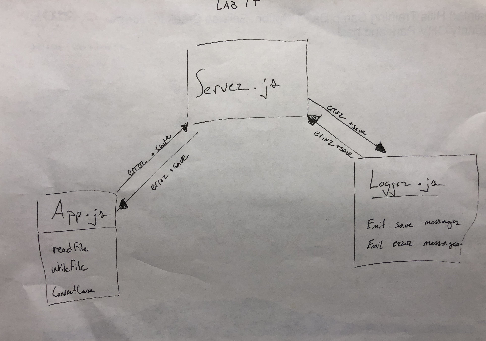

# Lab 17 TCP Server / Message Application

### Author: Matt Wilkin

### Description

Create an event driven messaging server

### Links and Resources

* [Submission PR](https://github.com/mwilkin-401-advanced-javascript/lab-17/pull/1)

* [Travis](https://www.travis-ci.com/mwilkin-401-advanced-javascript/lab-17)

### Documentation

* [JSDOC] put `index.html` in an open web browser

* [UML] 

#### Dependencies
* jest

* lint

* jsdoc

* Modules

Exported Values and Methods

### Setup

#### Running the app

* in 3 separate terminal shells in the following order

* `nodemon server.js`

* `nodemon logger.js`

* `node app.js (filename)`

### Tests
How do you run tests?

`npm test`